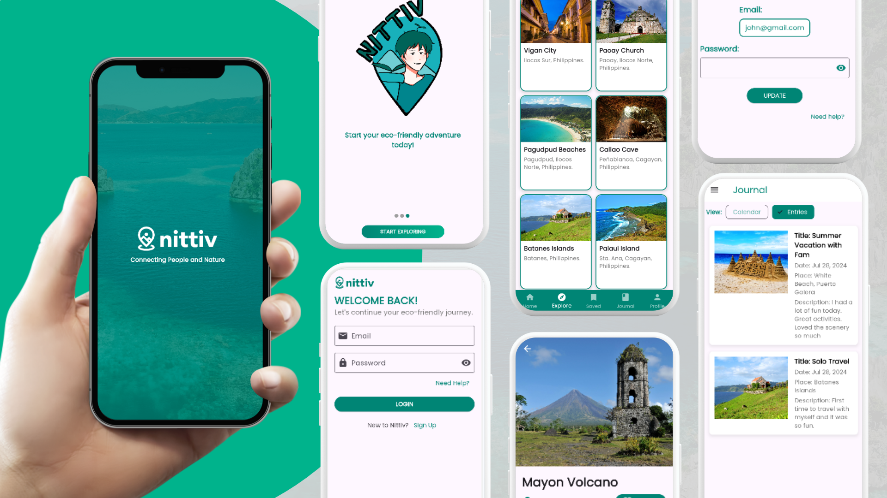

# Nittiv: Your Sustainable Travel Guide for Exploring the Philippines

## Project Overview

**Nittiv** is a mobile application designed to enhance the travel experience by providing users with eco-friendly travel recommendations and tools to document their journeys. Built using Flutter, Nittiv focuses on promoting sustainable tourism in the Philippines by highlighting eco-friendly tourist spots and providing resources for responsible travel.

## Features

- **Welcome Screen**: A friendly greeting sets the tone for the user’s journey.
- **Onboarding**: Guided introduction to the app's features for a smooth start.
- **User Authentication**: Secure login and sign-up options for personalized experience.
- **Home Screen**: Central hub with access to all main features.
- **Explore Venues**: Discover and save eco-friendly tourist spots in the Philippines.
- **Journal**: Document travel experiences with entries and photos.
- **Profile Management**: Update personal information and preferences.
- **Settings**: Access privacy settings, FAQs, and user guides.
- **Offline Access**: Access saved places and journal entries without an internet connection.
- **Sustainable Travel Tips**: In-app content promoting responsible tourism.

## Screens

### Welcome Screen
- The initial greeting screen that sets a welcoming tone.

### Onboarding Screens
- Step-by-step introduction to the app's features.

### Login/Sign Up
- Secure user authentication for personalized data management.

### Home Screen
- Central access point to explore venues, journal entries, and more.

### Explore Venues Screen
- Scrollable view of eco-friendly tourist spots in different regions of the Philippines.

### Journal Screen
- Log travel experiences, add photos, and write notes.

### Profile Screen
- Update personal information including profile picture and preferences.

### Settings Screen
- Manage privacy settings, access FAQs, and user guides.
